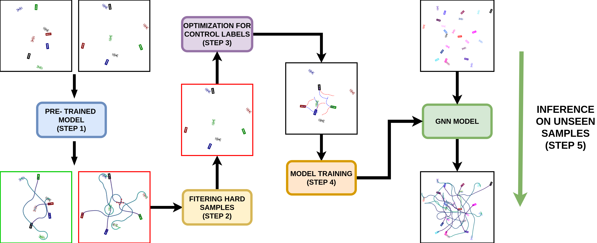
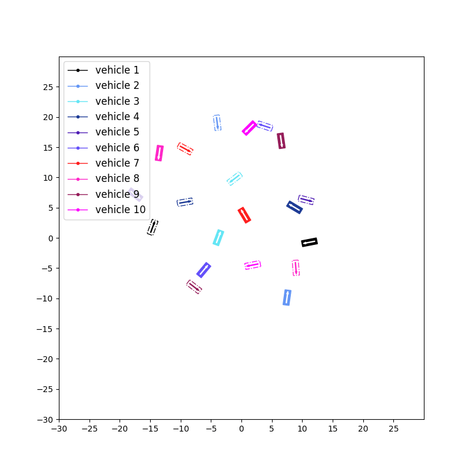
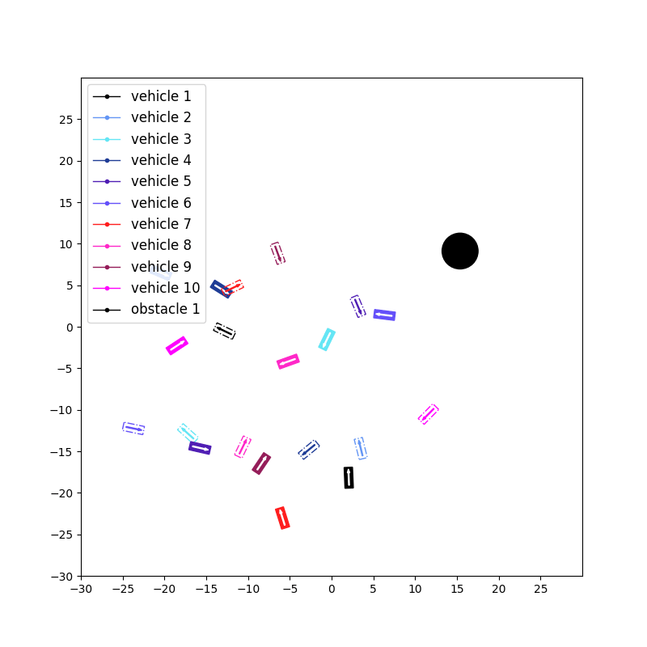
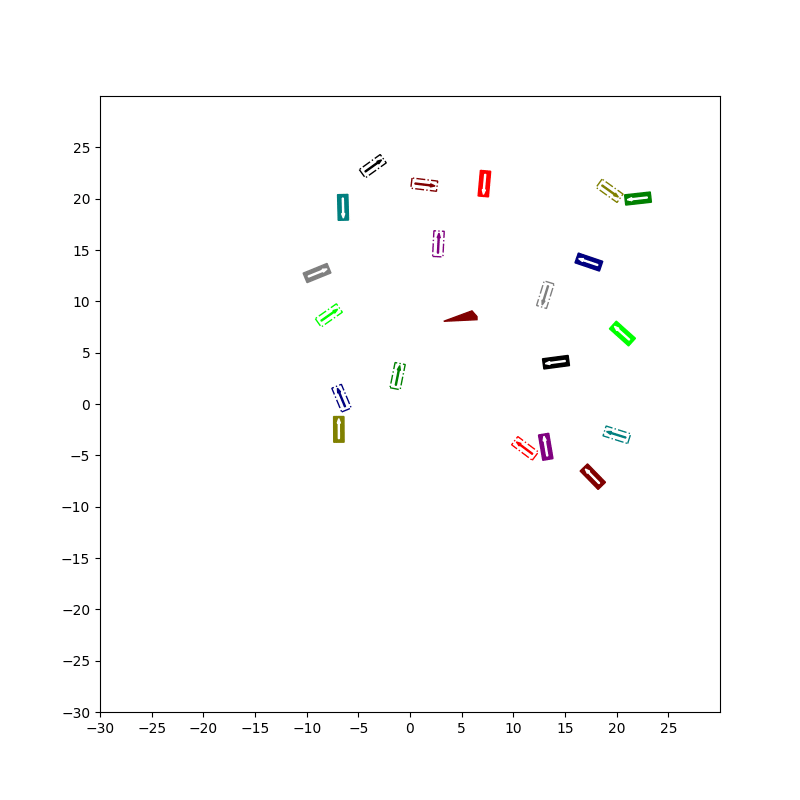

# Enhancing the Performance of Multi-Vehicle Navigation in Unstructured Environments using Hard Sample Mining

**Yining Ma, Ang Li, Qadeer Khan and Daniel Cremers**

[Project](https://yininghase.github.io/multiagent-collision-mining/) | [ArXiv](http://arxiv.org/abs/2409.05119)

This repository contains the official code for the paper **Enhancing the Performance of Multi-Vehicle Navigation in Unstructured Environments using Hard Sample Mining**.

Contemporary research in autonomous driving has demonstrated tremendous potential in emulating the traits of human driving. However, most existing methods primarily cater to areas with well-built road infrastructure and appropriate traffic management systems. In the absence of traffic signals or in unstructured environments, these algorithms are expected to fail. This paper proposes a strategy for autonomously navigating multiple vehicles in close proximity to their desired destinations without traffic rules in unstructured environments.

Graph Neural Networks (GNNs) have demonstrated good utility for this task of multi-vehicle control. Among the different alternatives for training GNNs, supervised methods have proven to be most data-efficient, albeit requiring ground-truth labels. These labels may not always be available, particularly in unstructured environments without traffic regulations, and a tedious optimization process may be required to determine them while ensuring that vehicles reach their desired destinations without colliding. Therefore, in order to expedite the training process, it is essential to reduce the optimization time and select only those samples for labeling that add the most value to training.

In this paper, we propose a warm-start method that first uses a pre-trained model trained on a simpler subset of data. Inference is then performed on more complicated scenarios to determine the hard samples wherein the model faces the greatest difficulty, measured by the difficulty vehicles encounter in reaching their desired destinations without collision. Experimental results demonstrate that mining for hard samples in this manner reduces the requirement for supervised training data by **10×**. Moreover, we use the predictions of this simpler pre-trained model to initialize the optimization process, resulting in a further speedup of up to **1.8×**.

<br />



<br />

## Table of Contents

- [Repository Structure](#repository-structure)
- [Installation](#installation)
- [Pretrained Models](#pretrained-models)
- [Quick Start](#quick-start)
- [Detailed Pipeline](#detailed-pipeline)
  - [Step 1: Generate Training/Validation Data](#step-1-generate-trainingvalidation-data)
  - [Step 2: Train the GNN](#step-2-train-the-gnn)
  - [Step 3: Run Inference](#step-3-run-inference)
  - [Step 4: Calculate Metrics](#step-4-calculate-metrics)
  - [Step 5: Hard-Sample Mining](#step-5-hard-sample-mining)
  - [Step 6: Visualize Results](#step-6-visualize-results)
- [Configuration Reference](#configuration-reference)
- [Data Format](#data-format)
- [Results](#results)
  - [Comparison of Baseline and Improved Models](#comparison-of-baseline-and-improved-models)
  - [GNN Model Inference Runtime](#gnn-model-inference-runtime)
- [Citation](#citation)

---

## Repository Structure

```text
multiagent-collision-mining/
├── README.md                          # This file
├── simulation.py                      # Main simulation loop (MPC and/or GNN rollout)
├── mpc.py                             # Model Predictive Control solver
├── generate_trainval_data.py          # Generate training/validation data with MPC
├── generate_test_dataset.py           # Generate fixed test scenarios
├── calculate_metrics.py               # Compute success/collision/efficiency metrics
├── data_process.py                    # Data loading, augmentation, and PyTorch Dataset
├── gnn.py                             # Iterative GNN model definition
├── u_attention_conv.py                # U-Net attention graph convolution layer
├── train.py                           # Supervised training with hard-data mining
├── inference.py                       # GNN inference on test scenarios
├── loss.py                            # Weighted MSE loss
├── visualization.py                   # Generate GIFs and static trajectory plots
├── configs/                           # YAML configuration files
│   ├── generate_trainval_data.yaml
│   ├── train.yaml
│   ├── inference.yaml
│   ├── calculate_metrics.yaml
│   └── generate_test_data.yaml
├── models/                            # Pretrained model checkpoints
│   ├── IterGNN_UAttentionConv_baseline.pth
│   ├── IterGNN_UAttentionConv_extend_hard_data.pth
│   └── IterGNN_UAttentionConv_extend_random_data.pth
└── images/                            # Result visualizations (GIFs and PNGs)
```

---

## Installation

Clone the repository and build the conda environment:

```bash
conda create -n multiagent python=3.7
conda activate multiagent
pip install torch==1.11.0+cu113 torchvision==0.12.0+cu113 torchaudio==0.11.0+cu113 -f https://download.pytorch.org/whl/torch_stable.html
pip install --no-index torch-scatter --no-cache-dir -f https://pytorch-geometric.com/whl/torch-1.11.0+cu113.html
pip install scipy
pip install --no-index torch-sparse --no-cache-dir -f https://pytorch-geometric.com/whl/torch-1.11.0+cu113.html
pip install --no-index torch-cluster --no-cache-dir -f https://pytorch-geometric.com/whl/torch-1.11.0+cu113.html
pip install --no-index torch-spline-conv --no-cache-dir -f https://pytorch-geometric.com/whl/torch-1.11.0+cu113.html
pip install torch-geometric==2.0.4
pip install pyyaml matplotlib tqdm numpy
```

> **Note:** The original code was tested with PyTorch 1.11.0 + CUDA 11.3 + PyTorch Geometric 2.0.4. Newer PyTorch/CUDA versions may require adjusting the package URLs and versions accordingly.

---

## Pretrained Models

The `models/` directory contains three checkpoints used in the paper:

| Model File | Description |
|------------|-------------|
| `IterGNN_UAttentionConv_baseline.pth` | The baseline model trained on the original simpler dataset. |
| `IterGNN_UAttentionConv_extend_hard_data.pth` | Baseline fine-tuned with additional **hard samples** selected via collision mining. |
| `IterGNN_UAttentionConv_extend_random_data.pth` | Baseline fine-tuned with the same amount of additional **randomly selected** data. |

To use a checkpoint for inference, set `model path` in [`configs/inference.yaml`](./configs/inference.yaml) to the desired file path.

---

## Quick Start

Below is a minimal end-to-end workflow. Each step is explained in more detail in the [Detailed Pipeline](#detailed-pipeline) section.

```bash
# 1. Generate training/validation data with MPC
python generate_trainval_data.py --config_path ./configs/generate_trainval_data.yaml

# 2. Train the GNN (optional: with hard data mining enabled)
python train.py --config_path ./configs/train.yaml

# 3. Run inference on the test set
python inference.py --config_path ./configs/inference.yaml

# 4. Calculate quantitative metrics
python calculate_metrics.py --config_path ./configs/calculate_metrics.yaml

# 5. (Optional) Hard-sample mining: see Step 5 below

# 6. Visualize selected trajectories
python visualization.py --config_path ./configs/inference.yaml
```

> **Note:** `visualization.py` reads the settings (e.g., `data folder`, `plot folder`, `figure limit`, `car size`) from the provided config file.

---

## Detailed Pipeline

The pipeline is based on the pipeline in [this repository](https://github.com/yininghase/multi-agent-control) with the addition of the hard-sample mining part.

### Step 1: Generate Training/Validation Data

Run MPC simulations to generate ground-truth control labels for supervised training.

```bash
python generate_trainval_data.py --config_path ./configs/generate_trainval_data.yaml
```

Key settings in [`configs/generate_trainval_data.yaml`](./configs/generate_trainval_data.yaml):

| Parameter | Typical Value | Description |
|-----------|---------------|-------------|
| `horizon` | `15` | MPC prediction horizon. |
| `simulation time` | `150` | Max simulation steps per trajectory. |
| `simutaion runs` | `3000` | Number of trajectories to generate. |
| `collect data` | `True` | Save training tensors (`X_data`, `y_data`, `batches_data`, `trajectory_data`). |
| `show optimization` | `True` | Must be `True` to run MPC. |
| `control init` | `""` or path | Path to GNN predictions used to warm-start MPC (empty disables warm-start). |
| `problem collection` | `[[3,1], ...]` | List of `[num_vehicles, num_obstacles]` scenarios to generate. |

Generated files are saved under the folder specified by `data folder`.

### Step 2: Train the GNN

Train the IterGNN controller on the data generated in Step 1.

```bash
python train.py --config_path ./configs/train.yaml
```

Key settings in [`configs/train.yaml`](./configs/train.yaml):

| Parameter | Typical Value | Description |
|-----------|---------------|-------------|
| `horizon` | `1` | Must be `1` for GNN training. |
| `train max epochs` | `500` | Maximum training epochs. |
| `batch size` | `4096` | Training batch size. |
| `initial learning rate` | `0.01` | Initial Adam learning rate. |
| `data folder` | list of paths | Training data folders. |
| `hard data mining` | see below | Extend the dataset with hard samples. |

The trained model and learning curves are saved under `model folder`/`model name`.

### Step 3: Run Inference

Use the trained GNN to drive vehicles in test scenarios.

```bash
python inference.py --config_path ./configs/inference.yaml
```

Key settings in [`configs/inference.yaml`](./configs/inference.yaml):

| Parameter | Typical Value | Description |
|-----------|---------------|-------------|
| `horizon` | `1` | Must be `1` for GNN inference. |
| `simulation time` | `200` | Max inference steps per trajectory. |
| `show optimization` | `False` | Must be `False` to use the GNN instead of MPC. |
| `model path` | `./models/...` | Path to the trained checkpoint. |
| `test data souce` | `fixed test data` | Use `fixed test data` for reproducible evaluation or `on the fly` for random cases. |
| `problem collection` | `[[8,0], ...]` | Test scenarios (supports up to 20 vehicles). |

Inference outputs are saved under `data folder` and later consumed by `calculate_metrics.py`.

### Step 4: Calculate Metrics

Compute success rate, collision rate, trajectory efficiency, and other metrics.

```bash
python calculate_metrics.py --config_path ./configs/calculate_metrics.yaml
```

Key settings in [`configs/calculate_metrics.yaml`](./configs/calculate_metrics.yaml):

| Parameter | Typical Value | Description |
|-----------|---------------|-------------|
| `data folder` | list of paths | Folders containing inference results to evaluate. |
| `number of vehicles` | `20` | Max number of vehicles in the evaluated data. |
| `num of obstacles` | `4` | Max number of obstacles in the evaluated data. |
| `car size` | `[1.0, 2.5]` | Vehicle width and length. |
| `save metrics` | `True` | Save results to `metrics.pt`. |

The resulting `metrics.pt` file contains, for each trajectory, fields such as `collision times` and `travel distance`.

### Step 5: Hard-Sample Mining

Hard-sample mining is the core contribution of the paper. The procedure is:

1. **Run inference** with a baseline model on challenging scenarios (Step 3).
2. **Calculate metrics** to obtain `collision times` and `travel distance` for each trajectory (Step 4).
3. **Select hard trajectories**: compute the collision rate as `collision_times / travel_distance` and pick the trajectories with the highest rates. The current code does **not** perform this selection automatically; you need to extract the desired trajectories manually or with a short script.
4. **Re-generate ground-truth labels** for the selected hard states by running `generate_trainval_data.py` with MPC. To do this:
   - Place the selected trajectories (still containing `batches_data`, `X_data`, `y_model_data`, and `trajectory_data`) into a dedicated folder, e.g. `./data/trainval_dataset/hard_samples/`.
   - In [`configs/generate_trainval_data.yaml`](./configs/generate_trainval_data.yaml), set `control init` to that folder:
     ```yaml
     control init: ./data/trainval_dataset/hard_samples
     ```
   - Set `simulation time: 1` so that MPC computes the ground-truth control for the current state **without** rolling the vehicles forward to the next time step.
   - Keep `show optimization: True` and `collect data: True`.
   - Run:
     ```bash
     python generate_trainval_data.py --config_path ./configs/generate_trainval_data.yaml
     ```
5. **Add the new labels to the training set**: list the new folder in the `hard data mining` section of [`configs/train.yaml`](./configs/train.yaml):
   ```yaml
   hard data mining:
     data folder extend:
       - ./data/trainval_dataset/data_generation_extend_hard_data
     percent data used: 1
   ```
6. **Retrain** the model (Step 2).

For the exact tensor shapes and feature ordering of the saved data files, see the [Data Format](#data-format) section below.

### Step 6: Visualize Results

Generate trajectory GIFs and static plots from a config file:

```bash
python visualization.py --config_path ./configs/inference.yaml
```

Make sure the config file specifies the desired `data folder`, `plot folder`, `figure size`, `figure limit`, `ticks step`, and `car size`.

---

## Configuration Reference

All scripts accept a `--config_path` argument pointing to a YAML file. The repository ships with the following configs:

| Config File | Used By | Purpose |
|-------------|---------|---------|
| [`configs/generate_trainval_data.yaml`](./configs/generate_trainval_data.yaml) | `generate_trainval_data.py` | MPC data generation, warm-start, and problem collection. |
| [`configs/train.yaml`](./configs/train.yaml) | `train.py` | Training hyperparameters and hard-data mining folders. |
| [`configs/inference.yaml`](./configs/inference.yaml) | `inference.py`, `visualization.py` | GNN inference and visualization settings. |
| [`configs/calculate_metrics.yaml`](./configs/calculate_metrics.yaml) | `calculate_metrics.py` | Metric computation settings. |
| [`configs/generate_test_data.yaml`](./configs/generate_test_data.yaml) | `generate_test_dataset.py` | Fixed test dataset generation. |

The extended test dataset containing 8 vehicles or more can be downloaded [here](https://cvg.cit.tum.de/webshare/g/papers/khamuham/multiagent-data/test_dataset_extension_8-20_vehicles.zip).

---

## Data Format

When `collect data: True`, `generate_trainval_data.py` and `inference.py` save four `.pt` files per scenario (`vehicle=V_obstacle=O`):

- `X_data_vehicle=V_obstalce=O.pt`
- `y_model_data_vehicle=V_obstalce=O.pt` (or `y_data_vehicle=V_obstalce=O.pt` for ground truth)
- `batches_data_vehicle=V_obstalce=O.pt`
- `trajectory_data_vehicle=V_obstalce=O.pt`

Consider `m` vehicles, `n` obstacles, and `T` total time steps across all trajectories.

### `X_data.pt`

Shape: `(T * (m + n), 8)`

Each `(m + n)` consecutive rows describe one time step. For each row:

| Feature | Vehicle Row | Obstacle Row |
|---------|-------------|--------------|
| `x` | vehicle x position | `0` |
| `y` | vehicle y position | `0` |
| `angle` | vehicle heading | `0` |
| `v` | vehicle velocity | `0` |
| `x_d` | desired x position | obstacle x position |
| `y_d` | desired y position | obstacle y position |
| `angle_d` / `r` | desired heading | obstacle radius |
| `type` | `0` (vehicle) | `1` (obstacle) |

Formally:

```text
vehicle:  [x, y, angle, v, x_d, y_d, angle_d, 0]
obstacle: [0, 0, 0,     0, x,   y,   r,       1]
```

### `y_data.pt` (ground truth from MPC)

Shape: `(T * m, 2 * N)` where `N` is the MPC horizon.

Each row contains the predicted pedal and steering-angle sequence for one vehicle at one time step:

```text
[pedal_0, steering_angle_0, pedal_1, steering_angle_1, ..., pedal_N, steering_angle_N]
```

For GNN training, `N = 1`, so each row has shape `(2,)`.

### `batches_data.pt`

Shape: `(T, 2)`

Each row records the composition of one time step:

```text
[[m + n, m],
 ...
 [m + n, m]]
```

where the first value is the total number of nodes and the second is the number of vehicles.

### `trajectory_data.pt`

Shape: `(num_trajectories + 1,)`

Contains the cumulative start indices of each trajectory in `X_data.pt`. For example, with three trajectories of lengths `t1`, `t2`, `t3`:

```text
[0,
 t1 * (m + n),
 (t1 + t2) * (m + n),
 (t1 + t2 + t3) * (m + n)]
```

These details are also documented in the comments of [`simulation.py`](./simulation.py) (lines 179–220).

---

## Results

### Comparison of Baseline and Improved Models

To show the effectiveness of hard data mining, we choose the pre-trained model as the baseline model [1] and additionally train the baseline with extra random data. Here we compare our model (**Baseline with additional Hard Data**) with the **Baseline Model** and **Baseline with additional Random Data** for two different scenarios.

As can be seen, only our model is capable of simultaneously driving all vehicles to their desired destinations without collision.

**Scenario 1:**

<table style="table-layout: fixed; word-break: break-all; word-wrap: break-word;" width="100%">
  <tr>
    <td width="50%">
      <strong>Our Model (Baseline with additional Hard Data)</strong>
    </td>
  </tr>
  <tr>
    <td width="50%">
      
    </td>
  </tr>
</table>

<table style="table-layout: fixed; word-break: break-all; word-wrap: break-word;" width="100%">
  <tr>
    <td width="50%">Baseline Model</td>
    <td width="50%">Baseline with additional Random Data</td>
  </tr>
  <tr>
    <td width="50%"></td>
    <td width="50%"></td>
  </tr>
</table>

**Scenario 2:**

<table style="table-layout: fixed; word-break: break-all; word-wrap: break-word;" width="100%">
  <tr>
    <td width="50%">
      <strong>Our Model (Baseline with additional Hard Data)</strong>
    </td>
  </tr>
  <tr>
    <td width="50%">
      
    </td>
  </tr>
</table>

<table style="table-layout: fixed; word-break: break-all; word-wrap: break-word;" width="100%">
  <tr>
    <td width="50%">Baseline Model</td>
    <td width="50%">Baseline with additional Random Data</td>
  </tr>
  <tr>
    <td width="50%"></td>
    <td width="50%"></td>
  </tr>
</table>

More scenarios are shown on the [project page](https://yininghase.github.io/multiagent-collision-mining/), which also contains the **Probability Density Function of Collision Rate** and **Robustness Analysis for Steering Angle Noise and Position Noise**.

[1]: Y. Ma, Q. Khan and D. Cremers, "Multi Agent Navigation in Unconstrained Environments using a Centralized Attention based Graphical Neural Network Controller," 2023 IEEE 26th International Conference on Intelligent Transportation Systems (ITSC), Bilbao, Spain, 2023, pp. 2893-2900, doi: 10.1109/ITSC57777.2023.10422072.

### GNN Model Inference Runtime

Average runtime per inference step for different vehicle/obstacle configurations, measured on a GeForce RTX 2070 GPU and an Intel Core i7-10750H CPU.

| Num. of Vehicle | Num. of Obstacle | Runtime on GPU (s) | Runtime on CPU (s) |
| --------------- | ---------------- | ------------------ | ------------------ |
| 8               | 0                | 0.00775            | 0.00823            |
| 8               | 1                | 0.00788            | 0.00874            |
| 10              | 0                | 0.00773            | 0.01027            |
| 10              | 1                | 0.00804            | 0.01144            |
| 12              | 0                | 0.00801            | 0.01314            |
| 12              | 1                | 0.00807            | 0.01391            |
| 15              | 0                | 0.00805            | 0.01604            |
| 20              | 0                | 0.00806            | 0.02440            |

---

## Citation

If you find this work useful, please consider citing:

```bibtex
@misc{ma2024enhancingperformancemultivehiclenavigation,
      title={Enhancing the Performance of Multi-Vehicle Navigation in Unstructured Environments using Hard Sample Mining}, 
      author={Yining Ma and Ang Li and Qadeer Khan and Daniel Cremers},
      year={2024},
      eprint={2409.05119},
      archivePrefix={arXiv},
      primaryClass={cs.MA},
      url={https://arxiv.org/abs/2409.05119}, 
}
```
