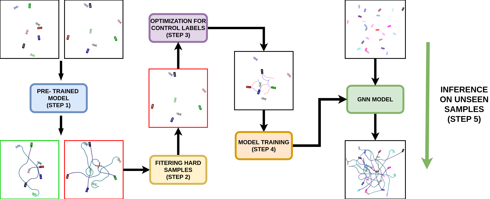

# Enhancing the Performance of Multi-Vehicle Navigation in Unstructured Environments using Hard Sample Mining

**Yining Ma, Qadeer Khan and Daniel Cremers**

[Project](https://yininghase.github.io/multiagent-collision-mining/) 

This repository contains code for the paper **Enhancing the Performance of Multi-Vehicle Navigation in Unstructured Environments using Hard Sample Mining** 

Contemporary research in autonomous driving has demonstrated tremendous potential in emulating the traits of human driving. However, they primarily cater to areas with well built road infrastructure and appropriate traffic management systems. Therefore, in the absence of traffic signals or in unstructured environments, these self-driving algorithms are expected to fail. This paper proposes a strategy for autonomously navigating multiple vehicles in close proximity to their desired destinations without traffic rules in unstructured environments. Graphical Neural Networks (GNNs) have demonstrated good utility for this task of multi-vehicle control. Among the different alternatives of training GNNs, supervised methods have proven to be most data-efficient, albeit requiring ground truth labels. However, these labels may not always be available, particularly in unstructured environments without traffic regulations. Therefore, a tedious optimization process may be required to determine them while ensuring that the vehicles reach their desired destination and do not collide with each other or any obstacles. Therefore, in order to expedite the training process, it is essential to reduce the optimization time and select only those samples for labeling that add most value to the training.  

In this paper, we propose a warm start method that first uses a pre-trained model trained on a simpler subset of data. Inference is then done on more complicated scenarios, to determine the hard samples wherein the model faces the greatest predicament. This is measured by the difficulty vehicles encounter in reaching their desired destination without collision. Experimental results demonstrate that mining for hard samples in this manner reduces the requirement for supervised training data by 10 fold. Moreover, we also use the predictions of this simpler pre-trained model to initialize the optimization process, resulting in a further speedup of up to 1.8 times.
<br />


<br />
<br />

## Comparison of Baseline Model and Improved Models

To show the effectiveness of hard data mining, we choose the pre-trained model as baseline model[1] and additionally train the baseline with additional random data. Here we show the comparison of our model (**Baseline with additional Hard Data**) with **Baseline Model** and **Baseline with additional Random Data**  for two different scenarios.

As can be seen, only our model is capable of simultaneously driving all the vehicles to their desired destinations without collision. For all other models, the vehicles collide with each other. 

 
**Scenario 1**:

<table style="table-layout: fixed; word-break: break-all; word-wrap: break-word;" width="100%">
  <tr>
    <td width="50%">
        <text>
          <strong>Our Model (Baseline with additional Hard Data)</strong>      
        </text>
    </td>
  </tr>
  <tr>
    <td width="50%">
        <figure>
            
        </figure>
    </td>
  </tr>
</table>
<table style="table-layout: fixed; word-break: break-all; word-wrap: break-word;" width="100%">
  <tr>
    <td width="50%">
        <text>
        Baseline Model         
        </text> 
    </td>
    <td width="50%">
        <text>
        Baseline with additional Random Data
        </text>
    </td>
  </tr>
  <tr>
    <td width="50%">
        <figure>
            
        </figure>
    </td>
    <td width="50%">
        <figure>
            
        </figure>
    </td>
  </tr>
</table>


**Scenario 2**:

<table style="table-layout: fixed; word-break: break-all; word-wrap: break-word;" width="100%">
  <tr>
    <td width="50%">
        <text>
          <strong>Our Model (Baseline with additional Hard Data)</strong>      
        </text>
    </td>
  </tr>
  <tr>
    <td width="50%">
        <figure>
            
        </figure>
    </td>
  </tr>
</table>
<table style="table-layout: fixed; word-break: break-all; word-wrap: break-word;" width="100%">
  <tr>
    <td width="50%">
        <text>
        Baseline Model         
        </text> 
    </td>
    <td width="50%">
        <text>
        Baseline with additional Random Data
        </text>
    </td>
  </tr>
  <tr>
    <td width="50%">
        <figure>
            
        </figure>
    </td>
    <td width="50%">
        <figure>
            
        </figure>
    </td>
  </tr>
</table>

More scenarios are shown in the [project page](https://yininghase.github.io/multiagent-collision-mining/).

For the interested reader, the project page also contains **Probability Density Function of Collision Rate** and **Robustness Analysis for Steering Angle Noise and Position Noise**.

[1]: Y. Ma, Q. Khan, and D. Cremers, “Multi agent navigation in unconstrained environments using a centralized attention based graphicalneural network controller,” in IEEE 26th International Conference on Intelligent Transportation Systems, 2023.
<br />


## GNN Model Inference Runtime

Here we show results the average runtime per inference step of our model on GeForce RTX2070 GPU and Intel Core i7-10750H CPU.

| Num. of Vehicle | Num. of Obstacle | Runtime on GPU (s) | Runtime on CPU (s) |
| --------------- | ---------------- | ------------------ | ------------------ |
| 8               | 0                | 0.00775            | 0.00823            |
| 8               | 1                | 0.00788            | 0.00874            |
| 10              | 0                | 0.00773            | 0.01027            |
| 10              | 1                | 0.00804            | 0.01144            |
| 12              | 0                | 0.00801            | 0.01314            |
| 12              | 1                | 0.00807            | 0.01391            |
| 15              | 0                | 0.00805            | 0.01604            |
| 20              | 0                | 0.00806            | 0.02440            |
<br />


## Environment

Clone the repo and build the conda environment:
```
conda create -n <env_name> python=3.7 
conda activate <env_name>
pip install torch==1.11.0+cu113 torchvision==0.12.0+cu113 torchaudio==0.11.0+cu113 -f https://download.pytorch.org/whl/torch_stable.html
pip install --no-index torch-scatter --no-cache-dir -f https://pytorch-geometric.com/whl/torch-1.11.0+cu113.html
pip install scipy
pip install --no-index torch-sparse --no-cache-dir -f https://pytorch-geometric.com/whl/torch-1.11.0+cu113.html
pip install --no-index torch-cluster --no-cache-dir -f https://pytorch-geometric.com/whl/torch-1.11.0+cu113.html
pip install --no-index torch-spline-conv --no-cache-dir -f https://pytorch-geometric.com/whl/torch-1.11.0+cu113.html
pip install torch-geometric==2.0.4
pip install pyyaml
pip install matplotlib
```


## Pipeline

To be announced.